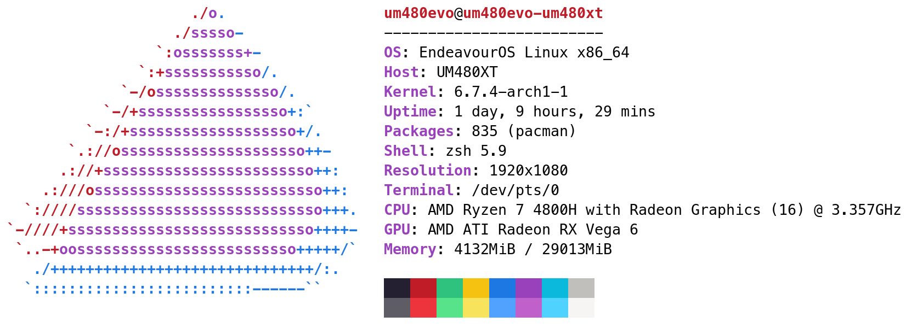

# Minisforum-UM480XT-hackintosh
Minisforum-UM480XT-hackintosh

本贴仅用于自己的记录，AMD核显硬解的问题我也无法解决

本配置来源于小明和他的女朋友，详情见他的github，感谢这里免费分享提供OC https://github.com/Xmingbai/Minisforum-UM480XT-hackintosh

# 我的配置

主机 ：Minisforum UM480XT

CPU ：R7-4800H 八核心十六线程

显卡 ：Vega7

内存 ：咸鱼垃圾内存 16G*2

硬盘 ：致钛tiplus5000 1TB

网卡 ：Intel AX210

# MacOS 完美程度
CPU 核心识别正常

USB端口定制

HDMI和Type-c 显示正常，HDMI支持4K120HZ

前置3.5音频正常、HDMI音频支持

I226V 网卡正常

intel AX200 WiFi 和蓝牙支持

睡眠与唤醒正常

更多问题请参考原主的github https://github.com/Xmingbai/Minisforum-UM480XT-hackintosh

# 变化内容
1、添加Linux系统的引导（ext4格式）

2、添加了harmoney OS的预览背景图(图源忘了哪里找的了，侵删)
